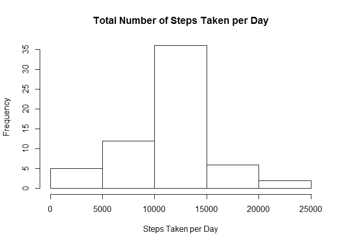

# Reproducible Research: Peer Assessment 1

## You will need to install knitr and lattice if not installed

```r
    library("knitr")
    library("lattice") 
    opts_chunk$set( fig.path = 'figures/' )
```

## Loading and preprocessing the data


```r
    activity <- read.csv("activity.csv", header=TRUE)
```

## What is mean total number of steps taken per day?

```r
# Get the sum of daily steps
    StepsPerDay <- aggregate(steps~date,data=activity, FUN=sum)
# plot the histogram
    hist(StepsPerDay$steps, main="Total Number of Steps Taken per Day", xlab="Steps Taken per Day")
```

 

```r
    stepMean <- mean(StepsPerDay$steps)
    stepMedian <-median(StepsPerDay$steps)
```
The mean number of steps taken per day is 1.0766 &times; 10<sup>4</sup>.
The median number of steps taken per day is 10765.

## What is the average daily activity pattern?

```r
#get mean  by interval
    pattern <- aggregate(steps~interval,data=activity, FUN=mean) 
    #plot the mean per interval
    plot(pattern$interval, pattern$steps,pch=19,
         main="Average Number of Steps Taken by Interval", xlab="Interval", 
         ylab="Average Steps", type="l")
```

 

```r
    maxSteps <-max(pattern$steps) # Get the max number of steps
# Get the interval that has the max number of steps
    maxInterval <- pattern[pattern$steps==maxSteps,1] 
```

Interval 835 contains the maximum number of steps.

## Inputing missing values

```r
    totalMissing <-sum(is.na(activity$steps))

# Create a vector of based on activity$steps, that replaces NA with the mean number of steps for that of interval
    filledSteps <- mapply(function(x, y) ifelse(is.na(x),round(with(pattern, subset(steps, interval==y)),digits=0),x), activity$steps,activity$interval)

# Create a new dataset by adding the new column
    filledActivity <- cbind(activity, filledSteps)

# Now repeat what we did on the base activity with the new

# Get the sum of daily steps
    FilledStepsPerDay <- aggregate(filledSteps~date,data=filledActivity, FUN=sum)
# plot the histogram
    hist(FilledStepsPerDay$filledSteps, main="Total Number of Steps Taken per Day", xlab="Steps Taken per Day")
```

 

```r
    FilledstepMean <- mean(FilledStepsPerDay$filledSteps)
    FilledstepMedian <-median(FilledStepsPerDay$filledSteps)
```

After filling in the NA values, the mean number of steps is 1.0766 &times; 10<sup>4</sup> compared to the original 1.0766 &times; 10<sup>4</sup>.
The Median number of steps is 1.0762 &times; 10<sup>4</sup> compared to the original 10765.

```

## Are there differences in activity patterns between weekdays and weekends?


```r
# Use the data with NAs filled in, Add a column thatindicates weekend or weekday

    getWeekend<- function(x) {
        temp <- weekdays(as.Date(x))
        ifelse(temp=="Saturday" | temp=="Sunday", "WeekEnd", "WeekDay")
    }

    filledActivity$dow <- getWeekend(filledActivity$date)

# store averages for intervals for both weekday/end
     weekMean<-aggregate(steps~interval+dow, data=filledActivity, mean) 


# lattice plot
     xyplot(steps~interval | dow, data=weekMean, main="Average Steps vs. Interval", 
            ylab="Steps", xlab="Interval", type="l", layout=c(1,2))
```

 

